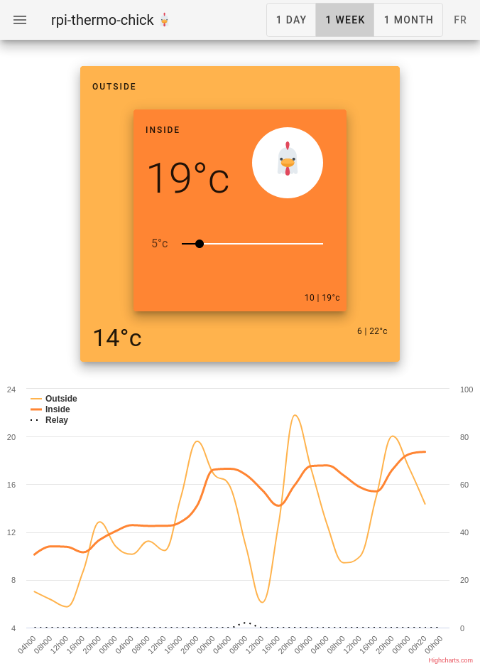

# rpi-thermo-chick 🐔🔥

Rapsbery-pi Thermostat for chicken.



Backend python 3 - fastapi / frontend vuejs - vuetify

[](https://badge.fury.io/py/rpi-thermo-chick)  [](https://badgen.net/badge/:subject/:status/:color?icon=github)


## Hardware

* Raspberry Pi (`zero` in that case, should work with all the other)
* Temperature sensor `DS18B20` using `1-wire` ([example](https://www.adafruit.com/product/381))
* Relay hat ([example](https://bc-robotics.com/shop/raspberry-pi-zero-relay-hat/))

## OS preparation

Enable `1-wire`: 

Add following lines to your `/boot/config.txt`:

```ini
[all]
dtoverlay=w1-gpio,gpiopin=3 
# default pin is 4 but it enter in conflict with relay hat
```

## Install

This project is meant to run as a  service (see next section), but to give it a try you can instal it as a normal user (lets assume as `pi` default user).

```bash
# install from pip repository
pip install rpi_thermo_chick

# create empty configuration file
sudo pi-thermo-chick.service configure

# edit configuration file (See configuration section)
sudo nano /root/.config/rpi-thermo-chick/config.json

```

## Install as a service

All the following command are prefix by sudo cause the service will be run as a service (as root user).

```bash
# install from pip repository
sudo pip install rpi_thermo_chick

# create empty configuration file
sudo pi-thermo-chick.service configure

# edit configuration file (See configuration section)
sudo nano /root/.config/rpi-thermo-chick/config.json

# install service (register in systemd)
sudo rpi-thermo-chick.service install

# now enable(auto start) and start  the service
sudo systemctl enable rpi-thermo-chick.service
sudo systemctl start rpi-thermo-chick.service

# check if the service is properly running
sudo systemctl status rpi-thermo-chick.service
```

Now service should be running (open `http://<pi-ip>:8000/app` to check) and will start automatically with the pi.

## Configuration

You have to configure 2 things, the pins you use for the relay and the device id of the thermometers.

To create default config file run:

```bash
pi-thermo-chick.service configure
```

It will create a config file in you current user configuration directory, edit that file (with `nano` or any other file editor).

For example if you user is `pi`, config file will be be `/home/pi/.config/rpi-thermo-chick/config.json`.

Configuration file content is a simple json and look like:

```json
{
    "relays": [ { "pin": 4 }, { "pin": 7 } ],
    "thermometers": [ { "device": "28-3c01d0751fcd" }, { "device": "28-3c01d075db96" } ]
}
```

### Configure thermometers

To know your thermometer device id run the following command:

```bash
ls /sys/bus/w1/devices | grep 28-*
```

It will return something like:

```
28-3c01d0751fcd
28-3c01d075db96
```

Update your configuration file with your own values. 

⚠️ **make sure the first thermometer is the inside thermometer that device will control the relay**.

### Configure relays

Simply update the config file with the physical gpio pins wired to the relays. 

⚠️ **make sure the first relays is the one controlling the load (second one is not used)**

## Development

```bash
git clone https://github.com/vrince/rpi-thermo-chick.git
cd rpi_thermo_chick

# see configuration
python rpi_thermo_chick/service.py configure

# run it locally
python rpi_thermo_chick/api.py --port 8000
```

* Open `http://<pi-ip>:8000/app` to see the `vuejs` app
* Open `http://<pi-ip>:8000` to see current state json payload

Note: replace `<pi-ip>` by you actual raspberry pi address, like `192.168.2.205`

### API

As the API use `fast-api` the documentation of the API can be access at `http://<pi-ip>:8000/docs`

## References

* [1-wire](https://pinout.xyz/pinout/1_wire#)
* [Adafruits ds18b20 (lesson 11)](https://learn.adafruit.com/adafruits-raspberry-pi-lesson-11-ds18b20-temperature-sensing)
* [fastapi](https://fastapi.tiangolo.com/)
* [vuejs](https://vuejs.org/)
* [vuetifyjs](https://vuetifyjs.com/en/)